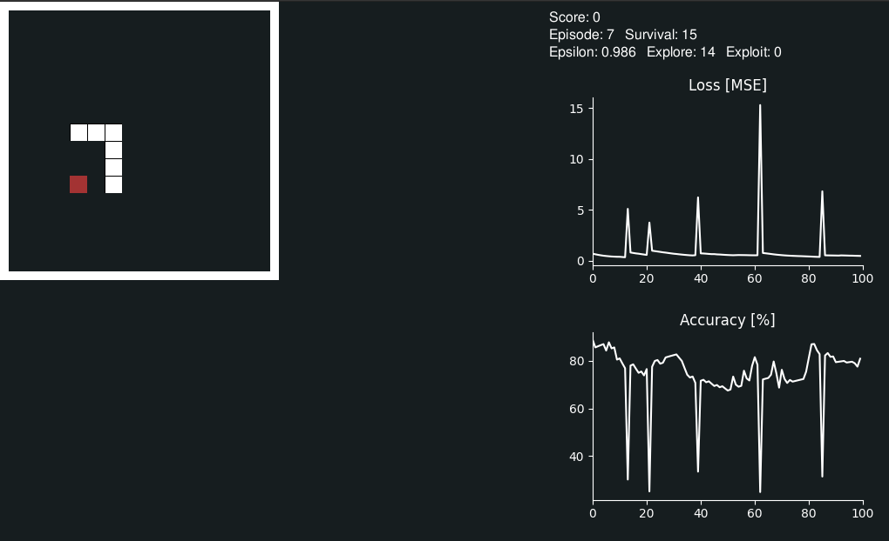
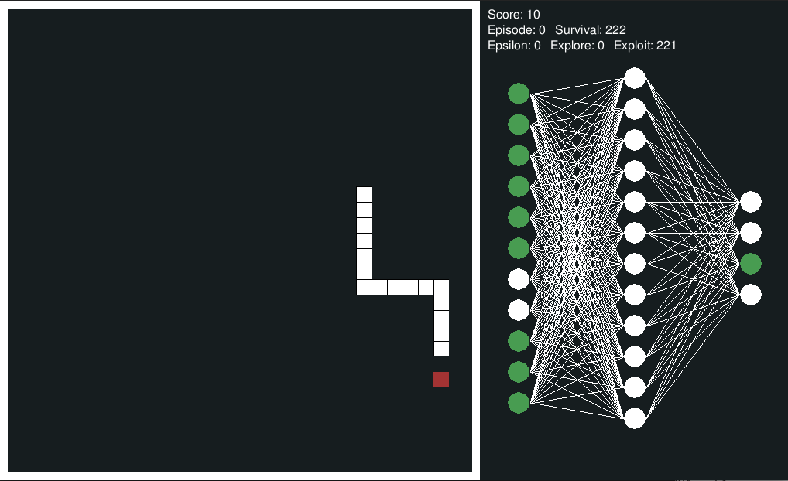

# Deep Q-Learning Applied to the Snake Arcade Game
This repo contains the codes implementing a playground for a Deep Q-Learning neural network to automatically play the Snake arcade game.

## Structure of This Repo
The repository is organized as follow:
- the `src` folder contains all the required well-documented codes.
- the `scripts` folder contains the scripts to train and test a new agent.
- the `docs` folder contains the documentation about the Deep Q-Learning
- the `weights` folder contains the pre-trained weights (after 120 epidsodes)

## Install
Firstly create and activate a virtual environment:
```bash
python3 -m venv .venv
source .venv/bin/activate
```

Now install the requirements:
```bash
sudo ./setup.sh
```

## How to Train and Test a New Agent
To train a new agent simply open a terminal and run:
```bash
python3 scripts/train_snake.py
```
In the training file you can provide the size of the game display. I used 320 pixels as width and height.

An example of the training phase is the following:  
  

To test a pre-trained agent, open a terminal and run:
```bash
python3 scripts/test_snake.py
```

An example of the testing phase is the following:  


## Documentation
To get an overview of the Reinforcement learning and the Deep Q-Learning concepts please check the [documentation](docs/DeepQLearning.ipynb).  

The neural network is composed by one input layer with 11 neurons, one output layer with 4 neurons and three dense hidden layer with 256, 128 and 64 neurons respectively activated by the relu function.  

The state array representing the network fed as input to the neural network is a one-hot encoded array reporting the following information:
- position 0: report if there is an obstacle on the right by the snake POV
- position 1: report if there is an obstacle on the left by the snake POV
- position 2: report if there is an obstacle forward wrt by the snake POV
- position 3: report if there is the food on the right wrt the snake head
- position 4: report if there is the food on the left wrt the snake head
- position 5: report if there is the food on the top wrt the snake head
- position 6: report if there is the food on the bottom wrt the snake head
- position 7: report if the snake is gowing down
- position 8: report if the snake is gowing up
- position 9: report if the snake is gowing right
- position 10: report if the snake is gowing left  

##

(c) 2020, Luca Gioacchini
